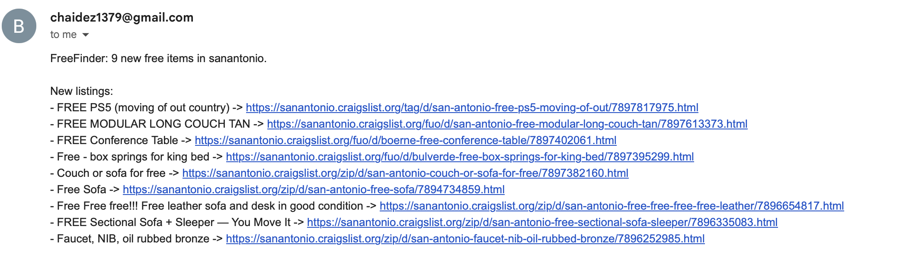

# FreeFinder

FreeFinder is a focused Python crawler that watches Craigslist’s free listings, filters out the noise, and stores the good finds in SQLite. It ships with multiple notification options so you can jump straight to the listings; the intended day-to-day workflow is an email digest with clickable links. The codebase is small, commented, and easy for a reviewer to skim and extend.

## Highlights

- Clear CLI workflow: build search URL → respect robots.txt → fetch → parse → filter → store → notify.
- Polite crawling: shared HTTP session, configurable delays, and robots.txt enforcement.
- Clean data: filter out stale or irrelevant items before the database; auto-purge rows older than seven days.
- Notifications: email digest with links (preferred), plus Slack, Twilio SMS, and ntfy push if you want alternates.
- Lean modules with inline comments for quick onboarding.

## Architecture

- `cli.py` – orchestrates the crawl: arguments, robots.txt check, fetching, parsing, filtering, DB writes, notifications.
- `fetcher.py` – HTTP session + headers and optional sleeps to stay polite.
- `sites/craigslist.py` – builds search URLs and parses list/detail pages, tracking posted/updated timestamps.
- `filters.py` – applies keyword allow/block lists and seven-day freshness checks.
- `storage/sqlite.py` – initializes the DB, upserts new listings, purges stale rows.
- `notify/` – pluggable channels:
  - `email.py` – SMTP email summaries with listing links (intended daily flow).
  - `slack.py` – Slack webhooks.
  - `sms.py` – Twilio SMS (optional).
  - `ntfy.py` – ntfy push topics (optional, no account needed).

## Getting Started

```bash
# 1) Create and activate a virtual environment.
python -m venv .venv
source .venv/bin/activate  # On Windows: .venv\Scripts\activate

# 2) Install dependencies.
pip install -r requirements.txt

# 3) Dry run (no DB writes).
.venv/bin/python cli.py --dry-run
```

## Run a Crawl

```bash
.venv/bin/python cli.py \
  --postal 78254 \
  --search-distance 30 \
  --max-items 120
```

Notable flags:
- `--dry-run` – print items, skip DB writes.
- `--max-items` – cap processed listings (default 120).
- `--detail-sleep MIN MAX` – control per-detail-page delay.
- `--allow-out-of-order` – keep crawling past the first stale listing.
- Notifications: `--email-to <addr>` (preferred), `--webhook <url>` (Slack), `--sms-to <number>` (Twilio), `--ntfy-topic <topic>`.
- ntfy extras: `--ntfy-title`, `--ntfy-priority 1-5`, `--ntfy-click <url>`.

## Notifications (Email First)

### Email with Listing Links (intended workflow)
Daily digest with a count plus direct URLs for every kept item. Example output (note the suspicious “FREE PS5 (moving out of country)”—why can’t they pack it in the suitcase?).



```bash
export SMTP_SERVER=smtp.gmail.com
export SMTP_PORT=587
export SMTP_USERNAME=your_email@gmail.com
export SMTP_PASSWORD=your_app_password
export EMAIL_FROM=your_email@gmail.com
export EMAIL_TO=destination@example.com

.venv/bin/python cli.py \
  --postal 78254 \
  --search-distance 30 \
  --max-items 120 \
  --email-to "$EMAIL_TO"
```
Flags override env vars: `--email-to`, `--email-from`, `--smtp-server`, `--smtp-port`, `--smtp-username`, `--smtp-password`, `--smtp-use-ssl`.

### Slack
1) Create an “Incoming Webhook” in Slack.  
2) Run with `--webhook https://hooks.slack.com/...`.  
Sends one-line summaries when new rows are inserted.

### Twilio SMS (Optional)
```bash
export TWILIO_ACCOUNT_SID=ACxxxx
export TWILIO_AUTH_TOKEN=...
export TWILIO_FROM_NUMBER=+1TWILIO
export SMS_TO_NUMBER=+1YOURNUMBER
.venv/bin/python cli.py --postal 78254 --search-distance 30 --max-items 120 --sms-to "$SMS_TO_NUMBER"
```
If Twilio vars are present, one SMS summary is sent per crawl insert.

### ntfy Push (Optional, No Account)
```bash
export NTFY_TOPIC=freefinder-alerts
export NTFY_SERVER=https://ntfy.sh   # default; self-host if you like
# Optional:
# export NTFY_USER=alice
# export NTFY_PASSWORD=secret
# export NTFY_TOKEN=...
# export NTFY_TITLE="FreeFinder"
# export NTFY_PRIORITY=4
# export NTFY_CLICK="https://ntfy.sh/freefinder-alerts"

.venv/bin/python cli.py --postal 78254 --search-distance 30 --max-items 120 --ntfy-topic "$NTFY_TOPIC"
```
Posts a one-line summary to the topic on each crawl that inserts new rows. It’s an interesting “no-setup” option: install the ntfy app, subscribe to `freefinder-alerts`, and you’re done. Two current limitations on iOS: you often have to manually pull to refresh to see new messages, and push popups can be unreliable. Also, Markdown/clickable links aren’t supported on Apple yet (action buttons exist but aren’t as simple), so if you want clickable URLs, email remains the easiest default.


## Schedule It (Once Per Day)

Recommended (macOS): use `launchd` with a wrapper script and `.env` (keeps secrets out of git).

1) Copy `.env.example` to `.env` and fill in your SMTP/email values (file is gitignored).
2) Make the wrapper executable: `chmod +x run_freefinder.sh`.
3) Copy `scripts/com.freefinder.daily.plist` to `~/Library/LaunchAgents/com.freefinder.daily.plist`.
4) Load it: `launchctl load ~/Library/LaunchAgents/com.freefinder.daily.plist` (unload with `launchctl unload ...`).

The plist runs `run_freefinder.sh` daily at 8am, logs to `/tmp/freefinder.log` and `/tmp/freefinder.err`, and reads secrets from `.env`. Adjust the hour/minute or paths in the plist as needed.

If you prefer cron or another scheduler, reuse `run_freefinder.sh` so you don’t duplicate config.

**macOS privacy note:** launchd agents can be blocked from `~/Documents` without Full Disk Access for `/bin/bash` and your Python binary. To avoid the prompt/denials, keep the project outside Documents (e.g., `/Users/guppycoder/Code/FreeFinder`, as this repo is now). If you must run from Documents, grant FDA to `/bin/bash` and your Python executable, then reload the agent. I couldn’t get FDA working for `/bin/bash` (and wasn’t sure it was worth the risk), so I moved the project instead—let me know if you have a clean approach.

## Data Hygiene

Every non-dry crawl calls `purge_stale_items` to drop rows older than seven days, keeping the database tight and current.

## Responsible Crawling

- Respect Craigslist: keep default delays unless you have a strong reason to change them.
- If you see 403/blocked responses, wait and retry later or from a different network.
- Skim any module to extend behaviour—the code is intentionally lean and documented.
